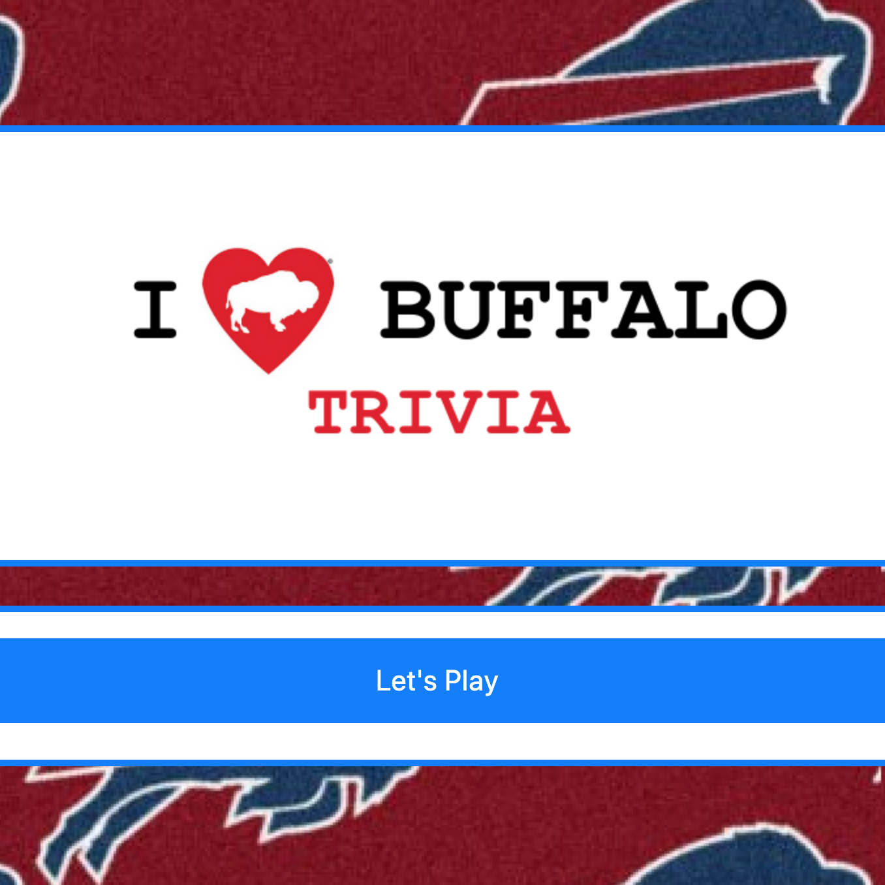

# trivia-game: I Love Buffalo Trivia

### Overview:

Trivia game using JavaScript for the logic and jQuery to manipulate HTML.
Other resources: CSS, Bootstrap, GoogleFonts

### Link to game: https://lindseytummond.github.io/trivia-game/

### How to Play:

<ul> 
  Trivia game that shows only one question until the player answers it or their time runs out.
<ul>
<ul>
  If the player selects the correct answer, a screen congratulating them for choosing the right option will appear. After a few seconds, the next question will display without user input.
<ul>
<ul>
  The scenario is similar for wrong answers and time-outs.
<ul>
<ul>
  If the player runs out of time, player's time is up and the correct answer displays. Wait a few seconds, then the next question displays.
<ul>
<ul>
  If the player chooses the wrong answer, the player will see the wrong option and then display the correct answer. Wait a few seconds, then the next question displays.
<ul>
<ul>
  On the final screen, the number of correct answers, incorrect answers, and an option to restart the game (without reloading the page) displays.
<ul>

